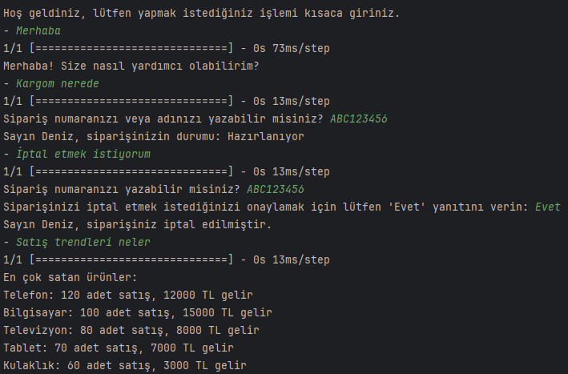

# **Chatbot Project**

## Açıklama: 
Bu proje, kullanıcı sorgularına yanıt verebilen ve sipariş durumu sorguları, sipariş iptalleri, şikayetler, müşteri geri bildirimleri, teslimat süresi tahminleri ve satış trendleri raporları gibi çeşitli görevleri yerine getirebilen bir sohbet botudur.

### Bu bot sadece deneme amaçlıdır.Türkçe veri seti bulunamadığı için Customer Service Chat Data 30K veriseti kullanılarak daha gelişmiş ingilizce bir bot geliştirme çalışmalarım devam etmektedir.

### Özellikler:

    Kullanıcı sorgularına yanıt verme
    Sipariş durumu takip 
    Sipariş iptali
    Şikayet kaydı
    Müşteri geri bildirimi
    Teslimat süresi
    Satış trendlerini ve en çok satan ürünler

### Kullanım:
    trainModel.py dosyasını çalıştırın ve modelin eğitilmesini bekleyin.
    chatbot.py betiğini çalıştırın.
    Sohbet botu sizi selamlayacak ve sorgunuzu veya isteğinizi girmenizi isteyecektir.
    Sorgunuzu veya isteğinizi yazın ve Enter tuşuna basın.
    Sohbet botu girdinizi işleyecek ve buna göre yanıt verecektir.

Bağımlılıklar:

    TensorFlow
    Keras
    NLTK
    transformers

Kurulum:

    pip install tensorflow keras nltk transformers

Gerekli NLTK kaynaklarını indirin:

    python -m nltk.downloader punkt wordnet
